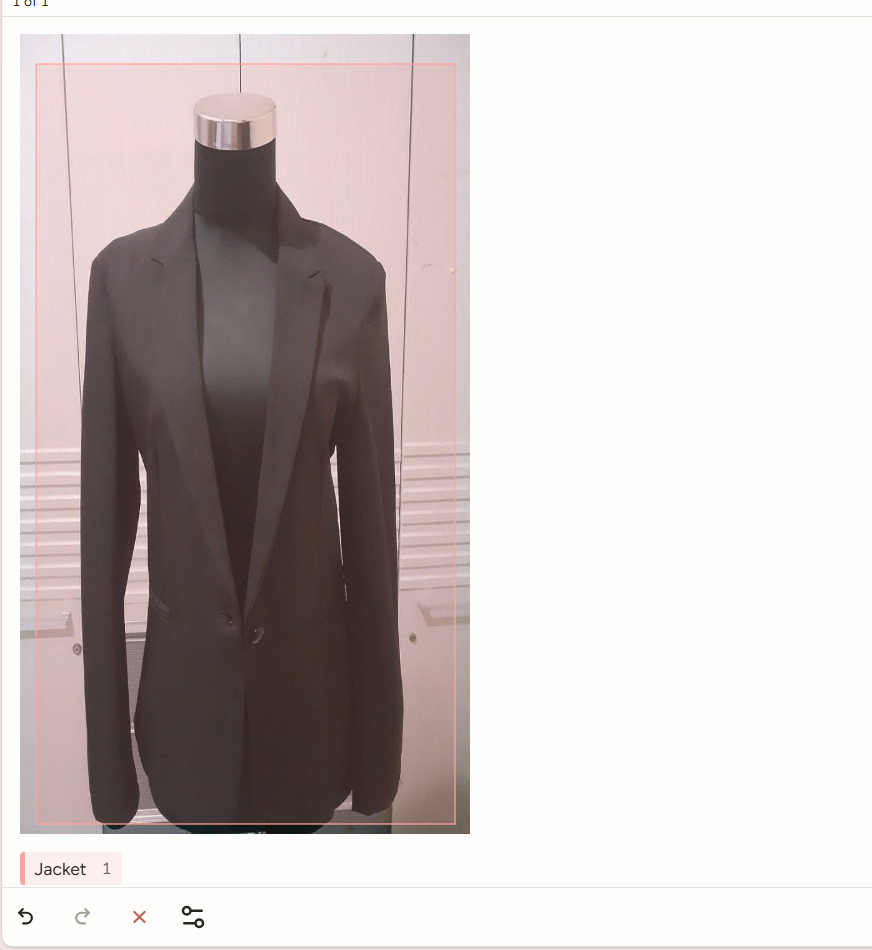
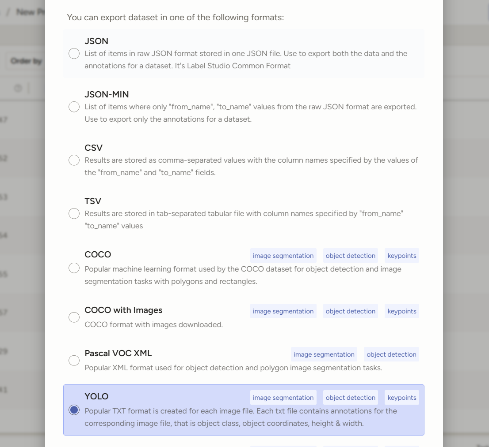
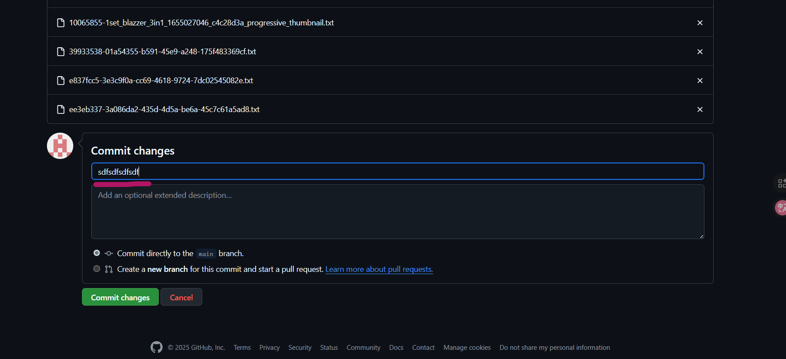

# Инструкция по работе

## Работа в Label Studio
### 0. Оптимальный алгоритм работы
Создайте папку labels где-то у себя. Туда вы будете выгружать готовые txt файлы.   
Оптимальный алгоритм работы:  
0.1. Загрузить 15-20 картинок в Label Studio  
0.2. Разметить картинки  
0.3. Выгрузить картинки на гитхиб  
0.4. Перейти к пункту 0.1.  
### 1. Запуск
1.0. Скопируйте и встаьвте в терминал:
```bash
cd ./data_work
```
#### Для винды:  
```bash
venv\Scripts\activate.bat
```
Слева от ```C:\Users\...``` должна появиться надпись ```(venv)```

#### Для не винды:
```bash
source venv/bin/activate
```
Слева от ```$``` должна появиться надпись ```(venv)```  

1.1. Запустите в терминале:
```bash
label-studio
```
Не завершайте выполнение команды

1.2. Откройте http://localhost:8080/  
1.3. Войдите  
1.4. Выберите свой проект  
1.5 Label All Tasks сверху, чтобы приступить к разметке ([инструкция по разметке](#2-пара-слов-о-разметке))  

### 2. Пара слов о разметке
1. Тыкните на цветную хрень с названием вашего label снизу слева
2. Обведите объект на фото в рамку. Делайте это максимально точно:

    Не заезжайте на объект, он весь должен находиться в рамке. Это плохо:

    

    Старайтесь не оставлять лишнего места в рамке. Это плохо:

    

    Это хорошо:

    

    От ваших действий напрямую зависит точность модели

3. Submit, чтобы перейти к следующей картинке
4. Нажмите на название своего проекта, чтобы закончить с разметкой и вернуться в проект

    

### 3. Выгрузка готовых картинок из Label Studio
1. Экспорт размеченных картинок  
    1.1. Выберите готовые картинки, протыкав idшники нужных справа / выберите все нажав на id сверху. 

    ### !!!! Внимательно выбирайте картинки. Не выбирайте несделанные. После выгрузки картинки станут txt файлами с координатами и нельзя будет понять, что вы выгрузили / как вы разметили картинки !!!!!   

    1.2. Export справа сверху -> пролистать вниз -> выбрать YOLO -> еще ниже -> Export  

    

    Загрузится зипка с файлами. [Загрузите их на гитхаб](#загрузка-labels-на-github)

2. Извлеките полученную зипку (пкм -> извлечь все). Пихайте в какую-нибудь определенную папку все содержимое внутренней папки labels.  
**Не саму папку labels, а только ее содержимое!**

### 4. Загрузка новых картинок в Label Studio
1. Импорт новых картинок  
    1.1. Import справа сверху -> Upload Files -> выберите картинки (опять же, все сразу выбрать не получится)

## Загрузка labels на github 
1. Откройте https://github.com/zaborch1k/vacc_data_label/tree/main/ready_images
2. Зайдите там в папку с названием своего label
3. Загрузите все txt из папки, в которую вы пихали содержимое labels, когда [выгружали картинки](#3-выгрузка-готовых-картинок-из-label-studio):  
Add file справа сверху -> Upload Files -> or choose your files -> выбираете файлы

      
    
    Напишите что-то вот тут и нажмите на зелененькое commit changes 

    

4. Очистите содержимое папки у себя 